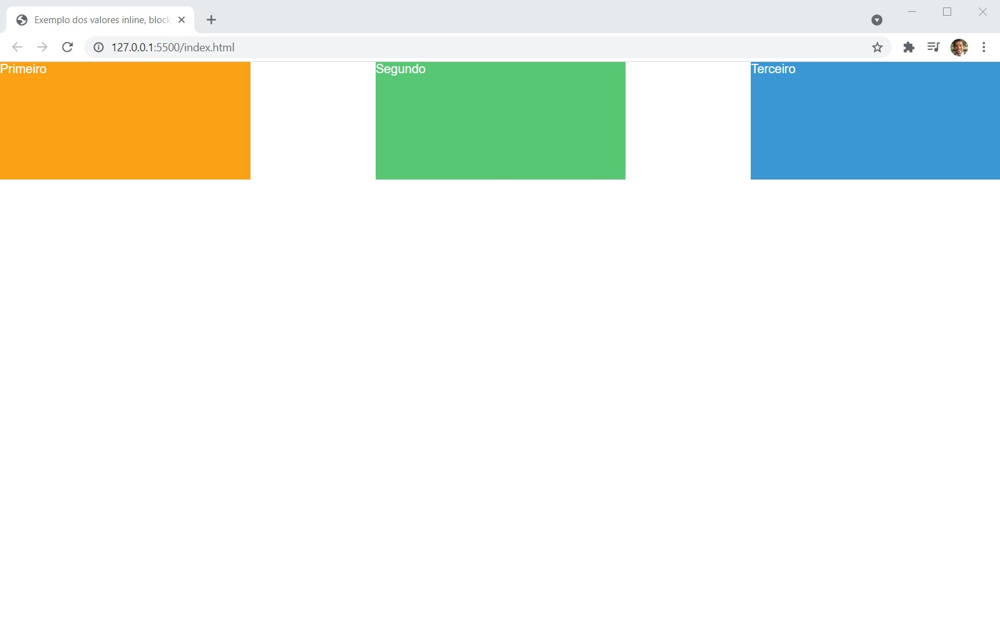

# Bloco 03 - Html e Css - Seletores e Posicionamento
#### Desafio Prático para consolidar o entendimento da propriedade display (inline / block / inline-block)

---
#### Desafio:
* Altere a folha de estilo definida no arquivo `css/style.css` de forma que o resultado alcançado seja igual a imagem abaixo:

